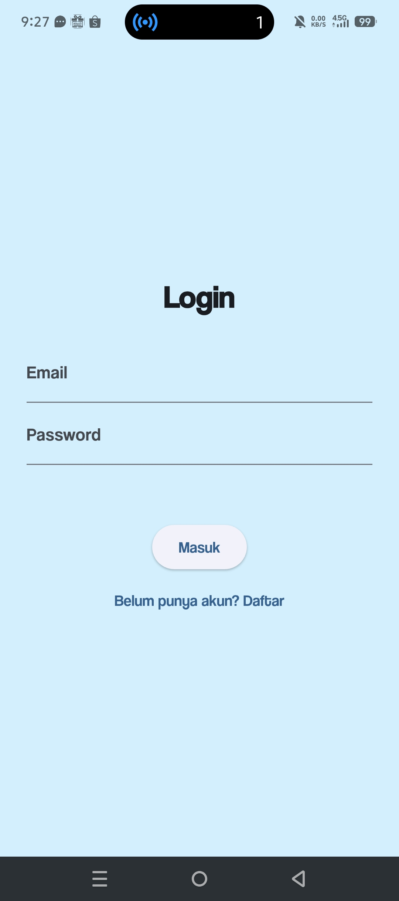
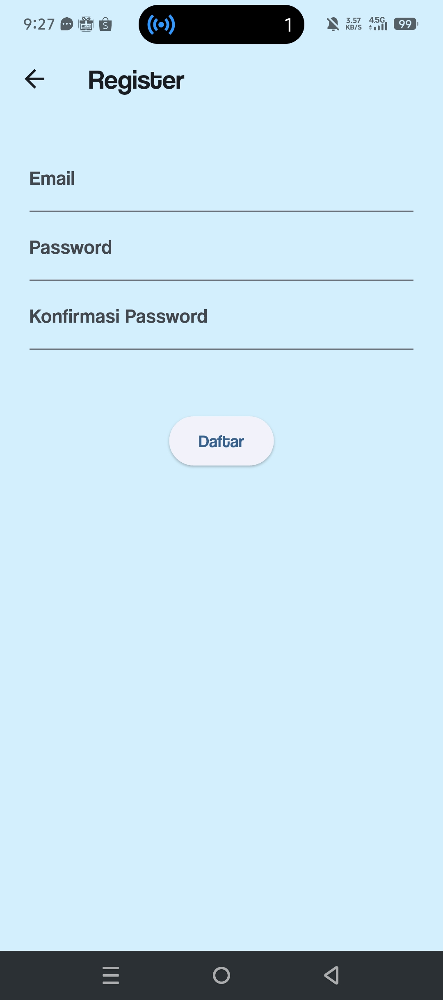
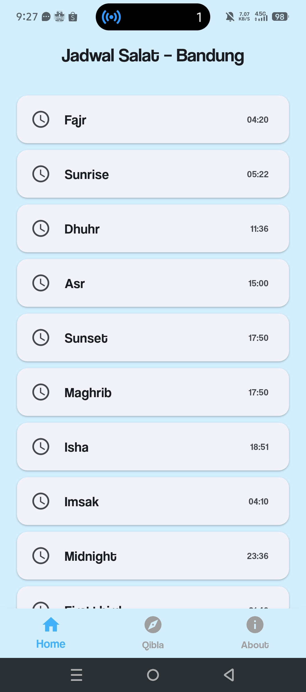
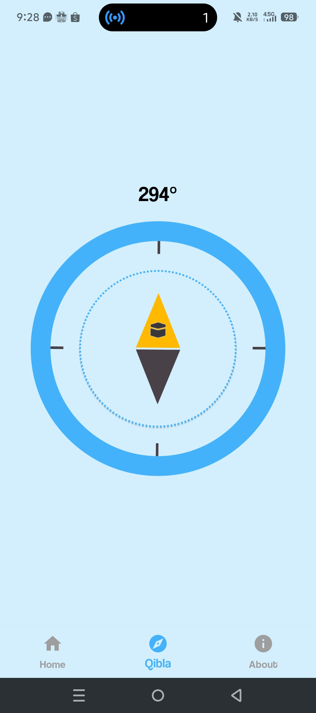

# 🕌 Qibla Mobile App (Flutter)

Aplikasi mobile penunjuk **arah kiblat** yang dibangun menggunakan **Flutter**, dilengkapi fitur **jadwal salat**, autentikasi (Login & Register), dan kompas kiblat.

## 📱 Fitur Utama

- 🧭 **Arah Kiblat**  
  Menampilkan arah kiblat menggunakan sensor kompas.

- 🕒 **Jadwal Salat (Home)**  
  Menampilkan jadwal salat harian berdasarkan lokasi pengguna.

---

## 🖼️ Screenshots

Berikut tampilan utama aplikasi:

| Login | Register |
|-------|----------|
|  |  |

| Home (Jadwal Salat) | Qibla | About |
|---------------------|-------|--------|
|  |  |  |

---

## 🚀 Teknologi yang Digunakan

- **Flutter** (SDK ^3.10.0)
- **Dart**
- `permission_handler`
- `flutter_qiblah`
- `http`
- `geolocator`
- `geocoding`

---

## 📦 Instalasi & Menjalankan Aplikasi

Clone repository:

```bash

git clone https://github.com/Afrizal8/qibla.git
cd qibla
